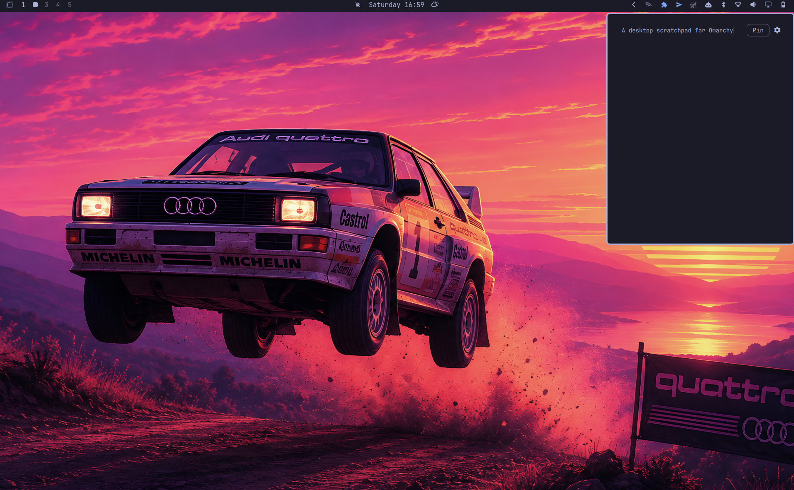

# Omascratch

A quick-note scratchpad for [Omarchy](https://omarchy.org/) that docks to a
corner of your screen. Toggle it with a keybind or the bar icon, type,
close — your text is still there next time.



## Features

- Notes autosave to disk as you type (debounced, no save button).
- Docks to any of the four screen corners; automatically clears whichever
  edge the Omarchy bar is docked to (top/bottom/left/right), so it never
  paints over the bar's own icons.
- Adjustable font size.
- The toggle keybind is rebindable from inside the panel itself — no manual
  editing of Hyprland config required.
- Optional status-bar icon (yellow squiggle) that toggles the same panel —
  and it really is optional: a `showIcon` setting hides it while the plugin
  and keybind keep working.
- **Pin button**: by default, clicking anywhere outside the panel closes it
  (matching every other panel in Omarchy's shell). Pin keeps it open instead,
  so it can sit visible in the corner while you work in other windows.

## Install

```
omarchy plugin add https://github.com/weedwhitesandwine/omascratch.git --enable
```

Add the bar icon (optional):

```
omarchy bar put io.github.weedwhitesandwine.omascratch --section right
```

Prefer no icon in the bar? Hide it — the plugin stays enabled and the
keybind keeps working:

```
omarchy bar set io.github.weedwhitesandwine.omascratch showIcon false --json
```

Bring the icon back:

```
omarchy bar set io.github.weedwhitesandwine.omascratch showIcon true --json
```

(Both take effect immediately.)

Add a keybind, e.g. in `~/.config/hypr/bindings.lua`:

```lua
o.bind("SUPER + R", "Toggle Omascratch", "omarchy-shell shell toggle io.github.weedwhitesandwine.omascratch")
```

(Or skip this — set it from the panel's own settings view instead; see
below.)

## Usage

- Open/close: your keybind, or the bar icon, or
  `omarchy-shell shell toggle io.github.weedwhitesandwine.omascratch`.
- `Escape` closes the panel while the notes view has focus.
- Click the gear icon (top-right of the card) to open settings:
  - **Font size** — `−`/`+` steppers, 10–28px.
  - **Position** — top-left / top-right / bottom-left / bottom-right.
  - **Keybind** — click the current combo, press a new one (exactly one
    modifier — Super, Ctrl, Alt, or Shift), click Apply.

## External dependencies and system-level modifications

This plugin runs `bash`, `awk`, `mkdir`, `cp`, and `hyprctl` via Quickshell's
`Process` — all standard on any Omarchy install, no extra packages required.

**The keybind picker in Settings modifies `~/.config/hypr/bindings.lua`.**
When you record and apply a new shortcut, `set-keybind.sh`:

1. Refuses outright if `bindings.lua` is a symlink, and makes a temporary
   backup of it beside itself under an unpredictable name (removed
   automatically when the script exits).
2. Rewrites the specific `o.bind(...)` line that toggles Omascratch,
   identified by matching the exact `omarchy-shell shell toggle
   io.github.weedwhitesandwine.omascratch` command string — no other line is
   touched. The rewrite is staged under an exclusively-created temporary name
   in the same directory and renamed over the file in one atomic step, so a
   symlink planted at any of those names is never written through.
3. Runs `hyprctl reload` and checks `hyprctl configerrors`.
4. If the reload produces any config error, restores the backup and reloads
   again — a bad rebind can't leave Hyprland in a broken state.

This is the only system configuration file this plugin ever writes to, and
only in response to an explicit action in the settings view (never
automatically).

## State files

- `~/.local/state/omarchy/omascratch/notes.txt` — your notes, plain text.
- `~/.local/state/omarchy/omascratch/settings.json` — font size, position,
  keybind. Created on first change; sensible defaults apply until then
  (14px, top-left, `SUPER + R`).

## License

MIT — see [LICENSE](LICENSE).
